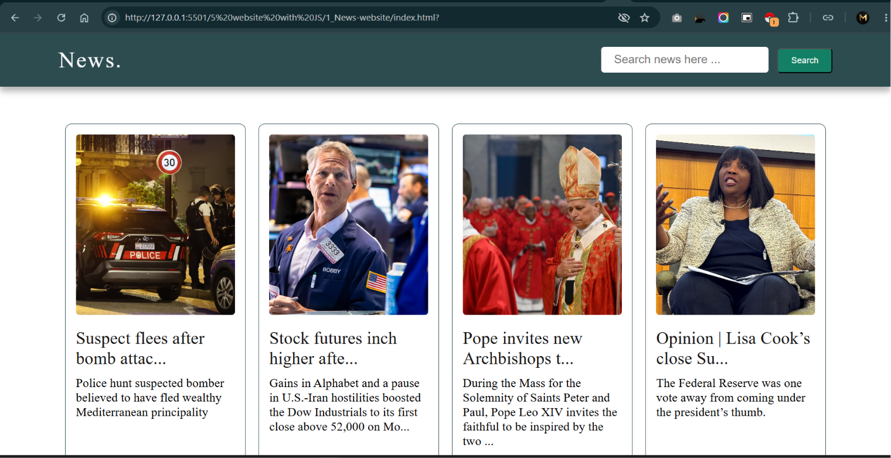
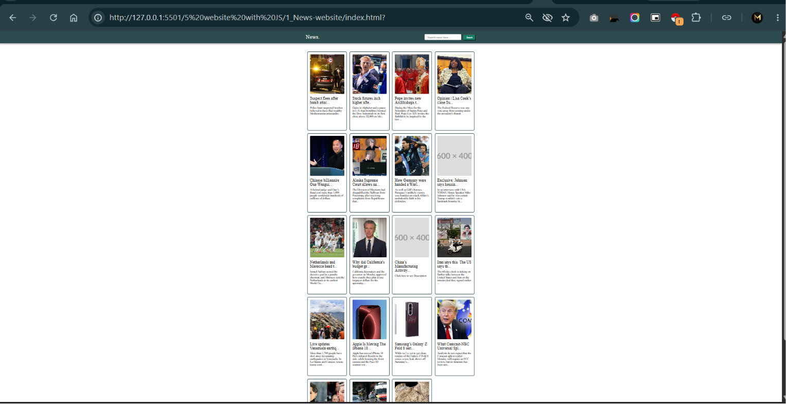
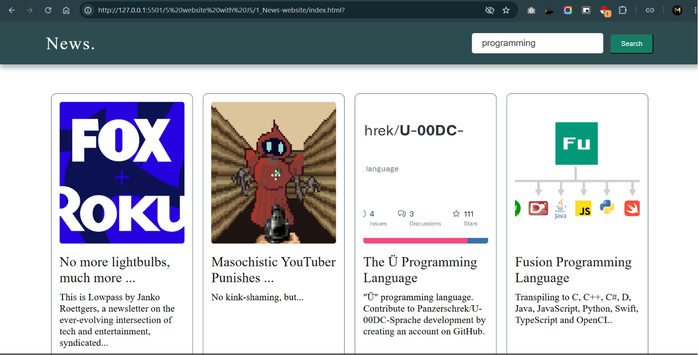

# Javascript Projects 

---

## 1. Food Website | [Live Demo](https://mayank-kapadane.github.io/Javascript_Projects/1_Food_Website/) | [Code](https://github.com/Mayank-Kapadane/Javascript_Projects)

Description : A responsive food website built with Bootstrap and Font Awesome, featuring a modern UI with a custom scrollbar, customer testimonials section, and a light/dark theme toggle. The project focuses on responsive layout design, reusable Bootstrap components, and enhanced user experience through interactive UI elements.

Tech Stack : HTML5, CSS3, JavaScript, Boostrap, Font Awesome

---

## 2. News Search Application

Description : A dynamic news search application that fetches the latest news articles using a News API. The project demonstrates API integration, asynchronous JavaScript, DOM manipulation, and an IIFE (Immediately Invoked Function Expression) for automatic initialization. Users can search news by keywords and browse real-time articles. An API key is required to run the application.

Tech Stack : HTML5, CSS3, JavaScript, DOM Manipulation, IIFE (Immediately Invoked Function Expression)

> NOTE: Since this project requires API_KEY and i don't want to expose the API i share the images of this project

1. Home page

2. Home page(zoom out)

3. Search Topic(eg. programming) in search bar

4. Topic related news

---

## 3. Calculator | [Live Link](https://mayank-kapadane.github.io/Javascript_Projects/3_Calculator/) | [Code](https://github.com/Mayank-Kapadane/Javascript_Projects/3_Calculator/)

Description : A responsive calculator application built with JavaScript that performs basic arithmetic operations. The project utilizes HTML data-* attributes to manage button actions, the eval() function to evaluate mathematical expressions, and event listeners to handle user interactions efficiently. It demonstrates DOM manipulation, event handling, and dynamic expression evaluation.

Tech Stack : HTML5, CSS3, JavaScript, Event Listeners, HTML data-* Attributes, eval() Function

---

## 4. Product Search & Filter | [Live Link](https://mayank-kapadane.github.io/Javascript_Projects/4_Product_search_bar/) | [Code](https://github.com/Mayank-Kapadane/Javascript_Projects/4_Product_search_bar/)

Description : An interactive product search application that filters products in real time as users type in the search bar. The project demonstrates dynamic DOM manipulation, event-driven programming, and efficient client-side searching to instantly display matching products without reloading the page, providing a smooth and responsive user experience.

Tech Stack : HTML5, CSS3, JavaScript, DOM Manipulation, real-time filtering

---

## 5. Counter | [Live Link](https://mayank-kapadane.github.io/Javascript_Projects/5_counter) | [Code](https://github.com/Mayank-Kapadane/Javascript_Projects/5_counter)

Description : A simple and interactive counter application that allows users to increment, decrement, and reset the counter value. The project demonstrates JavaScript fundamentals, including DOM manipulation, event listeners, and dynamic UI updates based on user interactions.

Tech Stack : HTML5, CSS3, JavaScript

---

Thank You

Thank you for visiting this repository.

This repository is a collection of my web development projects, created while learning and practicing HTML, CSS, Bootstrap, JavaScript, APIs, and modern frontend development concepts.

I regularly add new projects and improve existing ones as I continue learning. Feedback, suggestions, and contributions are always welcome.

If you found these projects helpful, consider giving this repository a ⭐.